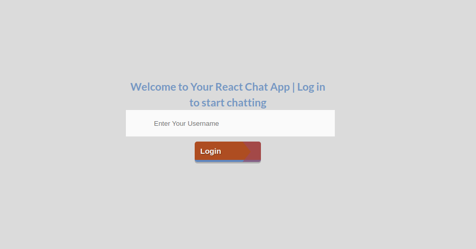
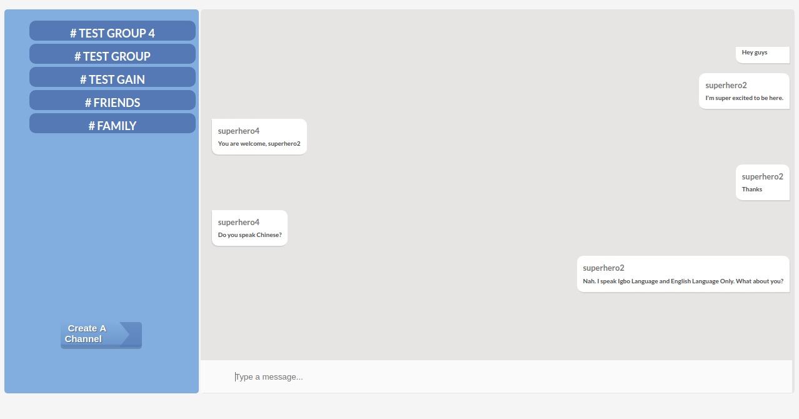

# React-Chat-App-with-CometChat Pro

<div style="width:100%">
	<div style="width:50%; display:inline-block">
		<p align="center">
			
		</p>	
	</div>	
</div>

Javascript Reactjs Tutorial Group Chat app (built using **CometChat Pro**).

It's a **group** messaging tutorial app. The app enables users to join chat groups and send **messages** to the groups they join as **text**.

## Table of Contents

1. [Screenshots](#Screenshots)

1. [Config Development Environment](#Config-your-Development-Environment)

1. [Config Chat App](#Config-Chat-App)

1. [Run the Sample](#Run-the-Demo-App)

1. [Contributing](#Contributing)

## Screenshots



<p align ="center"> Fig : Login page embedded in Website </p>
<br>



<p align ="center"> Fig : Chat Application embedded in Website </p>
<br></br>

## Config Development Environment

Setup your development environment for **Reactjs** Sample.

If you don't have node install, Please download appropriate version from official website: [Nodejs.org](https://nodejs.org/)

Once node and npm is installed successfully. You can verify from running following command :

```bash

node -v

```

```bash

npm -v

```

Now you are ready to sync application dependencies. Please follow the following steps:

1. Install packages

```bash

npm install

```

Please Check **package.json** file for the dependency list.

<br></br>

## Config Chat App

This chat app was built with create-react-app boiler plate.

Please change `appId` and `apiKey` in _src/settings.js_ to the provided credentials.


<br></br>

## Run the app

1. Test the demo app

You can test the demo app with local server by running the following command.

```bash

npm start

```

Navigate to **localhost:3000** to check sample app.

<br></br>

You can click on any of the groups by the left side of the screen to start chatting in that group.
